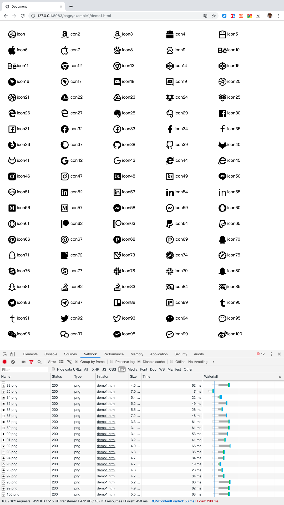
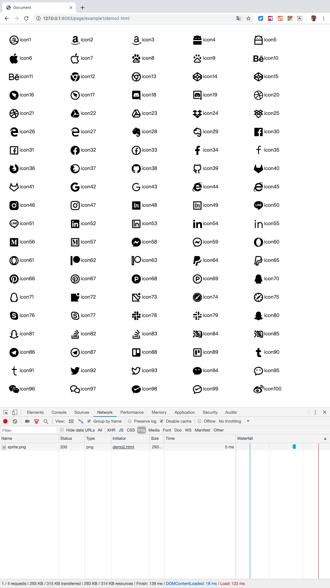
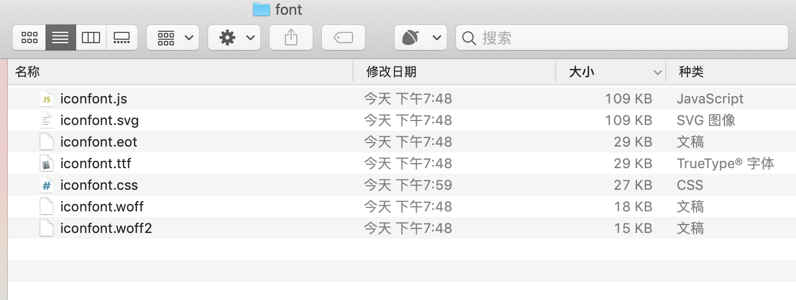
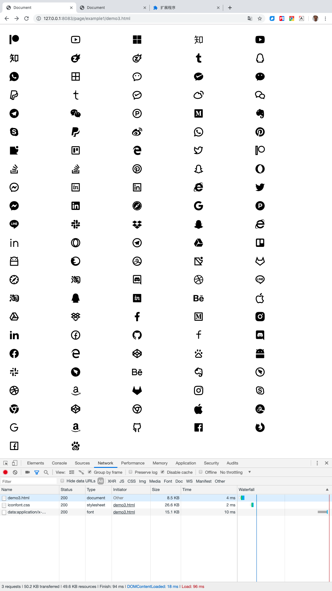
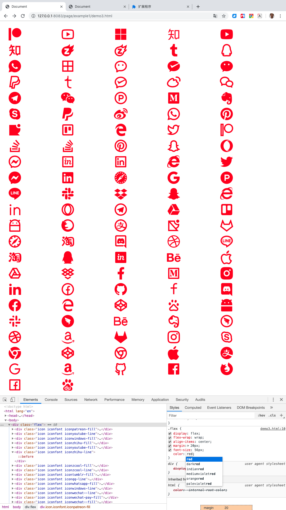

# CSS sprite，字体图标

很久之前，我们的网页上就开始有图片了，因为图片可以比文字更容易吸引人，更直观的表达我们的意图。所以，网页上开始有大量的图片，其中有很多是小图标。

最开始，按常规的做法，我们会切很多个小图片，每个图标都是一个图片文件，我们会在css里引用这些图片。

后来我们一个页面上可能会有好几十个小图标，虽然每一个都很小，但是最终加载这些图片，我们还是感觉到使用了不少时间。


## 怎么解决？
解决这个问题的办法是，我们把多个小图片合成为一张图大图，然后在css里用background-position配合width、height，让元素的背景显示大图的局部指定区域。

这样就做到了同一页面显示的多个图标，只需要加载一张图片。

这种做法，我们一般叫做CSS sprite、雪碧图或精灵图。

## 字体图标

随着HTML5的自定义字体规范在浏览器中普及，意味着网页中可使用的字体不在只依赖于用户客户端有哪些字体，我们现在可以随便指定什么字体，只要我们有字体文件就可以。
这让前端获得了一种特别的能力：一个特定的字符，前端可以通过指定特定的字体，让它显示为任何我们想要的样子。
利用这种能力，前端出现了像FontAwesome这类字体图标库，可以把一些特定的字符，显示为特定的图标。因为字体的特点，这些图标可以在css里随意指定大小、颜色，并且不管多大多小，都不会失真，因为它们本来就是文字。

所以，对于把一堆小图标文件合并为一个文件，除了生成一张大图用background-position定位，也可以用字体图标，这两种方法各有优缺点。字体图标虽然功能强大，但因为它需要画原始的矢量图，需要制作字体，难度和工作量相对大了很多，而精灵图就做起来很简单方便了。通常通用性很高，用质量要求很高的图标，适合用字体图标，其它普通场景，还是更适合精灵图。

## 原因是什么？
1. 每一个图标都是一个独立的文件，也就会产生一个独立的http请求。每一次http请求都需要经过一轮完整的流程，这个流程中，有很多步，每一步都需要时间。这个流程具体会经过哪些步骤，我们后面专门写一篇详细讲，这里只大概说一下最主要的。每个请求都要和服务器建立连接，并且都有请求头、请求体、响应头、响应体。而我们真正需要的，就只是响应体，也就是图片的内容。所以这里有很多的资源浪费，至少包括很多次的建立连接、请求头、响应头，请求体通常可能是空的，但其它几个都是实实在在需要流量和时间的。当我们把多个请求合并为一个时，自然就节省了很多流量和时间。

2. 图片编码时，一般都有文件头、图像头、颜色板，Exif信息，像素32位对齐等公共信息，一张图片就会有一份，多张图片合并为一张后，也可以节省这部分信息，尤其是极小的图片中，这些信息占的比重越高，优化的效果越明显。另外更多的信息放到一起，理论上也能获得更高的压缩率。

## 多说一点

很久以前，我们是在PS里手工合成大图，然后一点点测量background-position的正确位置，这个工作量还是不小的。后面前端有了node.js，然后有了各种构建工具，这个工作就交给构建工具自动完成了。我们在源码里只需要按原始的方式，切很多小图片，在css里直接引用这些小图，构建工具会自动生成合并的大图，同时自动修改css，设置正确的background-position。

## 看看实例

可以把本项目代码clone到本地，在本地环境启动服务

```
npm i
npm start
```

### 实例一：普通没优化的写法

[查看源码](demo1.html) -
[本地预览](http://127.0.0.1:8083/page/example1/demo1.html)

100个图标，在css里引用100个图片



总共加载了100个图片文件，图片总大小共472KB，页面加载用时共450毫秒。

### 实例二：CSS sprite合并图片的写法

[查看源码](demo2.html) -
[本地预览](http://127.0.0.1:8083/page/example1/demo2.html)

这个例子里，我们用了个工具，实现自动化合并图片并生成css。可以看到demo2有两个css文件，`demo2.css`相当于是css的源码，实际上这个文件里的css内容，和demo1.html里的完全一样，本来就是我从这复制出来的，没做任何改动。`demo2.dist.css`，是用工具根据`demo2.css`生成的，在`demo2.html`里，实际引用了`demo2.dist.css`。
要使用工具生成，请在命令行中，在本项目根目录下，执行下面的命令：
```
cd page/example1
node sprite
```

关于sprite.js说明一下，这个脚本主要是利用postcss-sprites模块实现的，但是它本身不支持指定比例缩放，而我的图片太大，我想缩小显示，所以我在它的基础上，改了个新的模块postcss-sprites-ratio，可以支持指定比例缩放。

下面看一下demo2.html的运行情况



总共加载了1个图片文件，图片总大小共293KB，页面加载用时共139毫秒。

### 实例三：用字体图标的写法

[查看源码](demo3.html) -
[本地预览](http://127.0.0.1:8083/page/example1/demo3.html)

这个例子使用的图标字体是用阿里的[iconfont](https://www.iconfont.cn)生成的，font目录里的文件，都是这个工具生成的，不同类型的字体文件，用来适配不同的浏览器环境，我测试使用的最新版chrome，优先使用的base64方案。首先我们看一下font目录里的字体文件（除了.css和.js都是不同格式的字体文件），除了svg格式，其它都不到30K，svg格式也才109k。并且我这字体里其实都包含了112个图标，demo1和demo2页面上都只显示了100个图标。



现在看一下demo3的页面运行情况



可以看到，一共3个请求，一个html页面，一个css，一个base64的data，其实上相当于就两个请求，总共大小49.6K，加载总用时94毫秒。

并且因为它是基于字体的，我们很容易改变图标的颜色和大小。我们直接在chrome控制台里改一下样式，`font-size改为56px，加个color: red`




### 总结

总结来看，demo2比demo1少加载了很多文件，加载速度也确实快了很多，并且我们的工作量其实也没有增加多少，使用工具，执行一个命令就可以了。

demo3相比demo2，加载文件数量其实没变，就是把图片文件换成了字体文件，至于base64，只要浏览器支持，图片也是可以base64到css里的。但是字体的文件体积确实比图片小了很多，所以加载速度也快了很多。并且对于后面图标的复用和维护上来说，字体的方案也灵活了很多。

那么现在大家可以看到，用字体的方案，性能上的优势非常明显。但是它的缺点是，要制作字体需要提供矢量图，这个工作量和难度非常大，也就是说成本很高。再一个是，如果要兼容很老的浏览器，可能浏览器不支持自定义字体，也是个大问题。

所以具体使用，还需要大家按自己的情况和使用场景做权衡，没有最好的，只有最合适的。