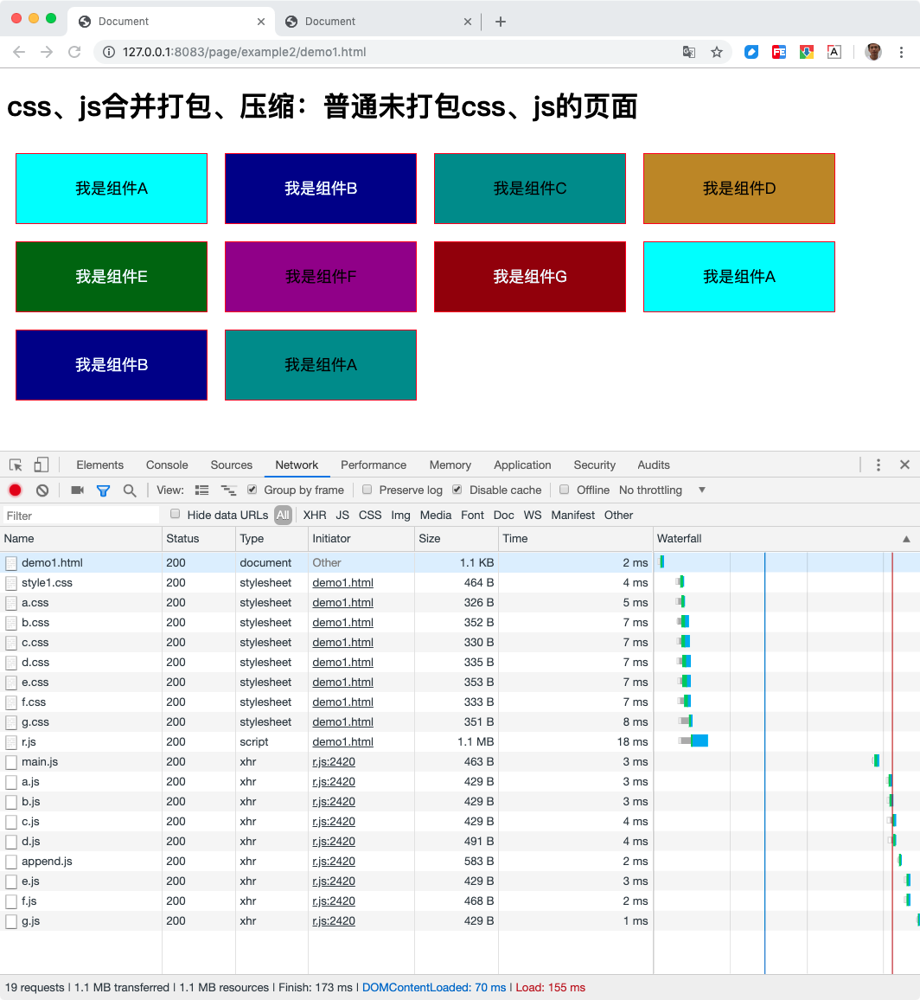
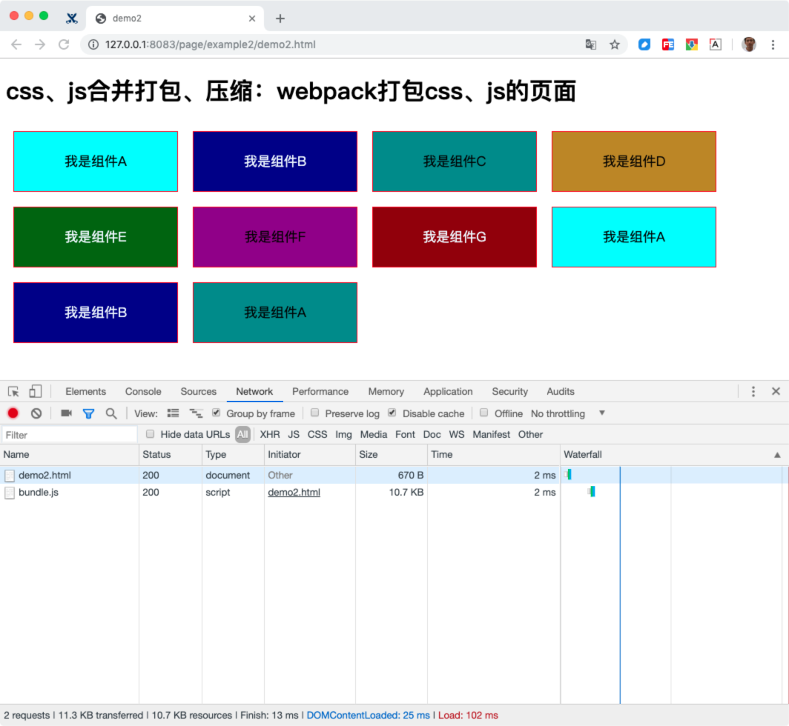

# css、js合并打包、压缩

上一节[雪碧图CSS sprite、字体图标](../example1/index.md)中我们把图片合并了，这一节我们合并css和js。上一节说过，每一个http请求都需要一些额外的时间，比如建立连接、请求头、响应头、文件头等，这些都需要资源和时间，所以我们的目标同样是减少http请求，减少页面加载的css和js的文件数量。

首先我们了解一下，为什么页面上会有大量的css文件和js文件。还是从历史开始，最早期网页刚出现时，浏览器的能力还没现在这么强大，产品需求也很简单，页面上就是简单的内容展示，加少量的js用户交互。所以，那时候一个页面或一类页面上的所有样式都写到一个css文件里、所有脚本都写到一个js文件里，也没有很多，不用显的很乱，维护起来问题不大。

后面浏览器功能越来越强大，能做更多更难的事情，产品的需求也就跟着越来越复杂，代码也就越来越多，越来越难以维护。逐渐的前端css和js有了组件化和模块化的概念，把复杂的任务分解为多个独立的小任务。虽然文件的组织结构复杂了，但是每一个文件的内容变简单了，好维护了。所以，这时候，我们页面上就需要加载很多小文件了。

现在我们知道了，为了开发时更容易维护代码，所以我们希望把代码分解了很多个小文件；为了浏览器加载时得到更好的性能，我们又希望把代码合并为尽量少的文件，最好是只有一个文件。那这就矛盾了，我们到底要分解还是要合并。

这个问题的解决方案是，我们两者都要，开发时，我们的源码是分解的小文件；上线时，我们把文件合并生成大文件，让用户的浏览器只加载少量的文件。看上去这是完美的，但是如果每次上线都要程序员手动合并文件，那工作量会非常大，搞错的概率也会非常大。

还好有node.js，聪明的前端工程师们用nodejs开发了一些工具，这些工具可以全自动完全上面合并文件的任务，解放了人类，并且几乎不会出错，还能在很短的时间（秒级别）内完成任务。

对了，我们本节的标题还提到了压缩，因为我们现在已经由工具来处理代码了，所以当代码被合并完成后，工具还可以顺便对合并完成的代码做个压缩甚至混淆，进一步减小文件的体积。

多说一句，基于node的这些工具的出现，让前端进入了工程化时代，这是革命性的质变。

## 具体怎么做？

说了这么多，具体该怎么做，有什么效果？

首先我们还是介绍一下业界使用最多的构建工具，为什么叫构建工具？是因为它们不只是用来实现代码打包合并，而是可以做工程化相关的几乎任何事情。我印象里最早的就是Grunt、FIS，后面还有Gulp，而目前最火热的是Webpack。这4个工具里，FIS是百度开源出品的，其它三个都是国外的。

这里多说一下我和FIS的故事，大概6年前，有幸去百度听内部技术分享，认识了当时百度FEX负责人[张云龙](https://github.com/fouber)大神，那时候FIS2刚开源（FIS1一直只在百度内部使用过），我就从此走上的前端工程化的道路。经过长时间对张云龙大神的骚扰请教，我在公司大力推广使用FIS2，对FIS有了深厚的感情。没过多久，大概一年左右，FIS3就面世了，FIS3比FIS2的架构更加灵活，功能更加强大，我也及时转向了FIS3，一直用到现在。在此也特别感谢在使用FIS3的过程中，FIS3的主要开发者[廖学之](https://github.com/2betop)大佬的帮忙。

好了，现在我们说正经的，这几个工具能做的事差不多，但是设计思路各自不同，所以用法不同。既然WebPack现在最流行，我们就拿它做例子。

## 看看实例

可以把本项目代码clone到本地，在本地环境启动服务

```
npm i
npm start
```

### 实例一：普通未打包css、js的页面

[查看源码](demo1.html) -
[本地预览](http://127.0.0.1:8083/page/example2/demo1.html)

这个例子我们使用require.js做模块化js管理，在页面上展示几个Dom模块。

一共准备了从A到G共7个模块，每个对应一个AMD规范的js模块，还有一个公用的，用来给dom插入节点的js模块append.js，还有一个入口模块main.js，这加起来是9个js文件，还有一个r.js是require.js框架本身的文件。

再看css，每个dom模块也有一个对应的从A到G的css文件，另外有一个style1.css的共用css文件，共8个。

这是纯手写的静态页，不需要工具，只是用到了一个Js的框架，所以拿源码直接访问就可以



可以看到，页面上一共加载了19个文件，其中10个js，8个css，一个html，共1.1MB，173ms时间。这1.1MB的大小，主要是require.js框架的。除了r.js，其它文件的大小我算了共8K，其中html共1.1KB，css共2.8KB，JS共4.1KB。


### 实例二：用Webpack打包合并页面中的css、js

[查看源码](demo2.html) -
[本地预览](http://127.0.0.1:8083/page/example2/demo2.html)

在Demo1的基础上，我们来做个优化，用Webpack工具把页面上加载的这些js和css文件打包合并成一个文件。

这里有个重要的概念有必要说明一下，大家应该知道，在require.js等js模块化框架中，是用define和require来定义和使用模块，其中框架会自动管理依赖关系等，而框架的这些工作，都是在浏览器里运行的，所以我们看到上面r.js那么大。

而我们现在使用Webpack工具，它是一个在开发者本地运行的工具，在我们写完代码要上线前，我们需要先在本地用webpack把源码处理一遍，然后自动生成新的代码，这些生成的代码就是用来上线的代码。在我们这个例子中，在webpack编译源码的过程中，它已经把各个模块之间的关系处理完毕的，这部分工作，本来是应该require.js在浏览器要执行的。所以，webpack处理的代码，在浏览器运行时，已经不需要require.js框架了，相当于我们在上线前，已经对代码做了一次预编译，真正在浏览器运行时，只需要执行必要的业务逻辑。这样我们最终在浏览器，加载的代码少了，执行的代码也少了。其实上，webpack同时在很多地方对我们的代码做了执行效率的优化。

现在你应该已经感受到了webpack带来的好处，让我们看一下实际效果。



可以看到，现在一共就加载了两个文件，一个html，一个js。总大小34.5KB，用时13ms，效果非常明显。

这里再单独说明一下demo2中webpack的使用。

首先因为我们最终加载的是webpack打包后的文件，所以demo2.html中，我们就不加载之前的那些js和css了，只加载一个打包后的文件dist/bundle.js，这个文件的路径和文件名，是我们在webpack的配置文件webpack.config.js中指定的。css/all.js这个文件，是用来把所有相关的css打包进来的一个入口文件。

另外因为webpack是基于npm安装的工具，我在example2目录下建了个package.json，就是专门给这个例子用的，查看这个例子前，需要在example2目录下安装一下npm的依赖模块，执行下面的命令
```
cd page/example2
npm i
```
要执行webpack的打包工作，执行下面的命令
```
npm run build
```
